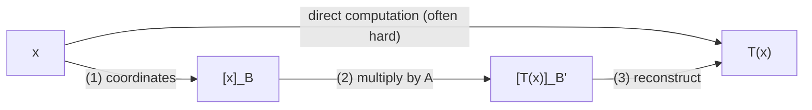

---
tags:
  - status/seed
  - linear-algebra
related:
  - "[[matrix-of-linear-transformation]]"
  - "[[coordinate-vector]]"
  - "[[change-of-basis]]"
  - "[[general-vector-spaces]]"
  - "[[linear-transformations]]"
  - "[[basis-and-dimension]]"
domain: linear-algebra
sources:
  - "Anton, Howard. Introducción al Álgebra Lineal. §5.4"
---

> **TL;DR** — Any linear transformation $T:V \to W$ between finite-dimensional vector spaces — polynomials, matrices, functions, not just $\mathbb{R}^n$ — becomes an ordinary matrix transformation once you swap vectors for their coordinate vectors: $A[\mathbf{x}]_B = [T(\mathbf{x})]_{B'}$.

---

## Intuition

[[matrix-of-linear-transformation]] only worked directly because $\mathbb{R}^n$ vectors are already lists of numbers — you could stack $T(e_1),\ldots,T(e_n)$ as columns. A polynomial or a matrix isn't a list of numbers by itself, so $T$ can't be multiplied by anything yet. The fix: use [[coordinate-vector]] to translate every abstract object into a genuine list of numbers relative to a chosen basis. Once $\mathbf{x}$ becomes $[\mathbf{x}]_B \in \mathbb{R}^n$ and $T(\mathbf{x})$ becomes $[T(\mathbf{x})]_{B'} \in \mathbb{R}^m$, the old matrix trick applies again — just one level removed, to coordinates instead of to the objects themselves.

## Mechanics

**Setup** — $V$ has dimension $n$ with basis $B=\{b_1,\ldots,b_n\}$; $W$ has dimension $m$ with basis $B'$. For $\mathbf{x} \in V$, $[\mathbf{x}]_B \in \mathbb{R}^n$ and $[T(\mathbf{x})]_{B'} \in \mathbb{R}^m$.

**Theorem (Anton §5.4)** — the map $[\mathbf{x}]_B \mapsto [T(\mathbf{x})]_{B'}$ is itself a linear transformation $\mathbb{R}^n \to \mathbb{R}^m$ (linearity of $T$ plus linearity of the coordinate map), so by [[matrix-of-linear-transformation]] there is a unique standard matrix $A$ ($m\times n$) with:

$$A[\mathbf{x}]_B = [T(\mathbf{x})]_{B'} \qquad (5.16)$$

**Building $A$ in practice** — since $[b_i]_B = e_i$ (a basis vector's coordinates in its own basis are always a standard basis vector), evaluating (5.16) at $\mathbf{x}=b_i$ gives $Ae_i = [T(b_i)]_{B'}$. So exactly as before, $A$'s columns are images of basis vectors — just now the images are coordinate vectors of $T(b_i)$ in $B'$, not $T(b_i)$ itself:

$$A = \begin{bmatrix}[T(b_1)]_{B'} & \cdots & [T(b_n)]_{B'}\end{bmatrix}$$

| Object | Lives in | Role |
|---|---|---|
| $\mathbf{x}$ | $V$ (dim $n$) | abstract input |
| $[\mathbf{x}]_B$ | $\mathbb{R}^n$ | coordinate proxy |
| $T(\mathbf{x})$ | $W$ (dim $m$) | abstract output |
| $[T(\mathbf{x})]_{B'}$ | $\mathbb{R}^m$ | coordinate proxy |
| $A$ | $\mathbb{R}^{m\times n}$ | bridges the two coordinate spaces |

**Using $A$ — the indirect procedure (Anton Fig. 5.11)** — once $A$ is built, computing $T(\mathbf{x})$ for any $\mathbf{x}$ never touches $T$ directly:



1. Compute the coordinate matrix $[\mathbf{x}]_B$.
2. Multiply on the left by $A$ to get $[T(\mathbf{x})]_{B'}$ — ordinary matrix-vector multiplication, nothing abstract left.
3. Reconstruct $T(\mathbf{x})$ from those coordinates (rebuild it as a linear combination of $B'$'s basis vectors).

The top arrow (direct computation) might be hard or require knowing $T$'s formula explicitly; the bottom route only ever needs matrix multiplication once $A$ exists.

**Why bother with the indirect route? (Anton §5.4)** Two reasons. First, it's how a computer actually carries out $T$ — digital arithmetic only understands matrix multiplication, not abstract objects like polynomials. Second, and more consequential: $A$ depends entirely on which bases $B,B'$ are chosen. Rather than picking bases to make *coordinates* easy, you can instead pick bases to make $A$ itself as simple as possible (lots of zero entries) — done right, that simplified $A$ reveals structural information about $T$ that isn't obvious from its original definition. This is the same instinct behind [[change-of-basis]]-driven diagonalization: choose the basis that makes the matrix simplest, not the basis that's easiest to compute in.

**Worked example, all three steps** — $T = d/dx$, from $P_2$ (degree $\leq 2$, basis $B=\{1,x,x^2\}$) to $P_1$ (degree $\leq 1$, basis $B'=\{1,x\}$). $T(1)=0$, $T(x)=1$, $T(x^2)=2x$, so their $B'$-coordinates are $(0,0)$, $(1,0)$, $(0,2)$:

$$A = \begin{bmatrix}0&1&0\\0&0&2\end{bmatrix}$$

Take $\mathbf{x} = p = 3-2x+5x^2$. **(1)** $[\mathbf{p}]_B = (3,-2,5)$. **(2)** $A(3,-2,5)^T = (-2,10)$. **(3)** reconstruct in $B'=\{1,x\}$: $-2(1) + 10(x) = -2+10x$ — matches $d/dx(3-2x+5x^2)$ computed by hand.

```python
import numpy as np

# p(x) = a0 + a1*x + a2*x^2, coordinates [a0, a1, a2] in B = {1, x, x^2}
A = np.array([[0, 1, 0],
              [0, 0, 2]])   # derivative operator, B -> B'

p = np.array([3, -2, 5])          # 3 - 2x + 5x^2
dp = A @ p                        # coordinates of derivative in B' = {1, x}
print(dp)                         # [-2, 10]  ->  -2 + 10x, matches d/dx by hand
```

**Second worked example — dimension increasing (Anton Example 30)** — $T:P_1\to P_2$, $T(p(x))=x\cdot p(x)$ (multiply by $x$), with $B=\{1,x\}$ and $B'=\{1,x,x^2\}$. $T(1)=x$, $T(x)=x^2$, giving $B'$-coordinates $(0,1,0)$ and $(0,0,1)$:

$$A = \begin{bmatrix}0&0\\1&0\\0&1\end{bmatrix}$$

A $3\times2$ matrix — the same column recipe works whether $T$ shrinks dimension (differentiation, above) or grows it (multiplication by $x$, here).

## In ML

**Feature engineering as a coordinate bridge** — turning raw structured data (text, molecules, polynomials fit to a curve) into a feature vector *is* choosing a basis and computing coordinates. Once that's done, every downstream linear operation (a linear layer, PCA) is exactly this matrix $A$ acting on coordinates, regardless of what the original object was.

**Embeddings as $B'$** — an embedding table defines the basis $B'$ that raw objects (tokens, images) get projected into; a linear layer applied afterward is the matrix $A$ from this theorem, connecting the abstract input space to a learned coordinate space.

**Composability with [[change-of-basis]]** — PCA changes coordinates within the *same* space; this theorem handles transformations *between different* spaces (e.g. compressing a high-dimensional space to a lower-dimensional one, as differentiation does above). Chaining both is exactly how a network layer followed by a change of basis (e.g. a rotation) composes in practice.

## Exercises

**Basic** — For $T:P_1 \to P_1$ defined by $T(a_0+a_1x) = a_0 + (a_0+a_1)x$, using the standard basis $\{1,x\}$ for both sides, find $A$. Confirm it matches treating $P_1$ as $\mathbb{R}^2$ directly via [[matrix-of-linear-transformation]].

**Intermediate** — Extend the derivative example to $T=d/dx: P_3 \to P_2$ (bases $\{1,x,x^2,x^3\}$ and $\{1,x,x^2\}$). Build the $3\times4$ matrix $A$, then use it to differentiate $2 - x + 3x^2 - x^3$ via coordinates only.

**Advanced** — Prove the column-construction formula directly: substitute $\mathbf{x}=b_i$ into (5.16) and show $[b_i]_B = e_i$, then explain why this forces $A$'s $i$-th column to equal $[T(b_i)]_{B'}$.
